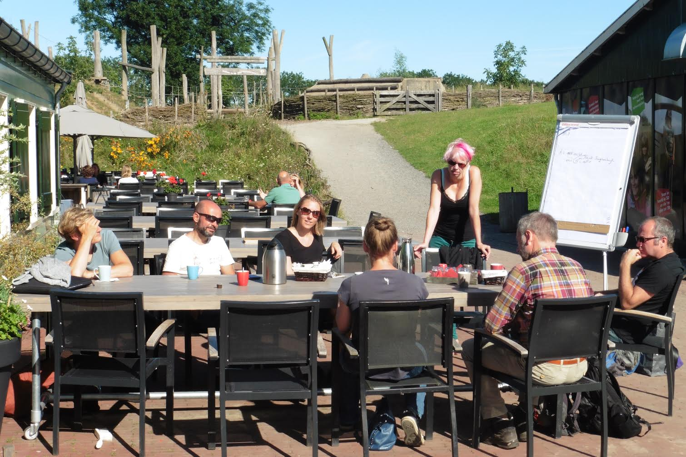

# Dag 1 Maptime Summercamp

## Ellen Gehring - Erfgoed Leiden
[www.erfgoedleiden.nl](http://www.erfgoedleiden.nl)  
[Cultuur historische waardenkaart](https://www.leidseregioinkaart.nl/kaarten/Cultuurhistorische_waarden/index.html)  
[Archeologische waardenkaart](https://www.leidseregioinkaart.nl/kaarten/Archeologie/index.html)  
[Bouwhistorische waardenkaart](https://www.leidseregioinkaart.nl/kaarten/Bouwhistorie/index.html)  
[www.erfgoedleiden.nl/api/opensearch/description-document](http://www.erfgoedleiden.nl/api/opensearch/description-document)  
[www.opensearch.org](http://www.opensearch.org)  
[www.erfgeo.nl](http://www.erfgeo.nl)  
[www.erfgoedenlocatie.nl](http://www.erfgoedenlocatie.nl/)
[Toponiemen standaardiseren](http://standaardiseren.erfgeo.nl/)  
[www.histograph.io](http://www.histograph.io)  
[wwww.mapwarper.net](http://www.mapwarper.net)  
[www.oldnyc.org](http://www.oldnyc.org)  
[buildinginspector.nypl.org](http://buildinginspector.nypl.org)  
[www.github.com/nypl-spacetime/map-vectorizer](http://www.github.com/nypl-spacetime/map-vectorizer)  
[omnesviae.org](http://omnesviae.org/nl/)  
[Erfgoed Leiden - Data voor dummies](https://www.erfgoedleiden.nl/educatie/open-data-blog)  
[Erfgoed Leiden - Data voor gevorderden](https://www.erfgoedleiden.nl/educatie/data-voor-gevorderden)  
[Erfgoed Leiden op GitHub](https://github.com/erfgoedleiden)   
[Kaart en Huis Brugge](http://magis.kaartenhuisbrugge.be/#)  
[Verdwenen gebouwen](http://www.verdwenengebouwen.nl/)
[Erfgeo Proxy](http://www.hicsuntleones.nl/erfgeoproxy/)

## Thijs Schouten - GitHub   
[Installing Git](https://git-scm.com/book/en/v2/Getting-Started-Installing-Git)
[GitHub Desktop](https://desktop.github.com/)   
[Markdown cheatsheet](https://guides.github.com/pdfs/markdown-cheatsheet-online.pdf) 

## Erik Meerburg - Carto   
[Groei van Delft](https://erikmeerburg.carto.com/viz/ac99e48c-8635-11e5-a076-0e31c9be1b51/public_map)  
[I scraped KPN](http://blog.puckipedia.com/blog/i-scraped-kpn/)   
[KPN internet snelheden in Delft](https://puckipedia.carto.com/viz/a2eb0a0e-acbb-11e5-9e02-0ef7f98ade21/public_map)  
[Mass shootings](https://erikmeerburg.carto.com/viz/3a2b3c28-68dc-11e5-97f4-0e31c9be1b51/public_map)  
[Shooting tracker](http://www.shootingtracker.com/)  

## Willem Hoffmans - Geocoderen   
[NLExtract](http://www.nlextract.nl)   
[PostGIS](http://postgis.net/)  

   
Bron: 20160815 foto door Marga te Woerd

## Marijn Bosma noemt enkele mooie StoryMaps

Bas van Delft, werkt bij Alterra.   In deze Storymap heeft hij ook info overgenomen en ontsloten van 
de okerkleurige boekjes met inhoudelijke toelichtingen bij de bladen van de Bodemkaart.   
Aangevuld met eigen foto's en veldwerkgegevens.   
[storymap over bodems van Nederland] (https://geodesk.maps.arcgis.com/apps/MapSeries/?appid=fb011dbc5037435ba3753369d7b0720b)

Ken Arts, won met deze Storymap de ESRI studentenprijs 2016.   
Atlas van de Ondergrond van Eindhoven   
? hierbij is een password nodig ?
[http://eindhoven.maps.arcgis.com/apps/MapJournal/index.html?appid=8de6a8b0b04a43d1a16f647f0262dd49](http://eindhoven.maps.arcgis.com/apps/MapJournal/index.html?appid=8de6a8b0b04a43d1a16f647f0262dd49)

Jeroen Groot   
Onder meer historische geografie, van de Provincie Drenthe   
[op de website van de Provincie Drenthe http://www.drenthe.info/website/drenthe200jaar/storymap/drenthe200jaar.html](http://www.drenthe.info/website/drenthe200jaar/storymap/drenthe200jaar.html)
